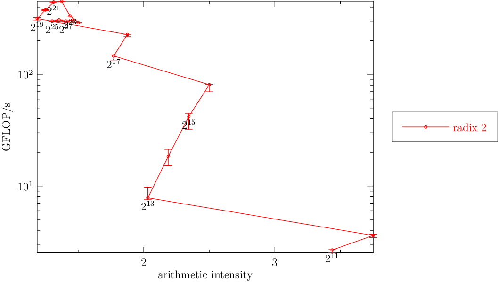

rocFFT performance
==================

.. toctree::
   :maxdepth: 2
   :caption: Contents:

Overview
--------

We want to:

* identify applications of interest
* identify transforms of interest
* measure and track performance of rocFFT vs cuFFT
* understand and explain any performance differences
* propose remedies
* implement and track over time

Proposed remedies may include algorithmic changes and/or optimization
work.  Optimization work may require interacting with the compiler
team.

Cases of interest
-----------------

For each application of interest, please choose a small handful of
representative cases that we can focus on.

CHOLLA
^^^^^^

JIRA tickets

* 1D Multiples of 21 and radix-7: `SWDEV-240404 <http://ontrack-internal.amd.com/browse/SWDEV-240404>`_
* 1D Multiples of 21 `SWDEV-268238 <http://ontrack-internal.amd.com/browse/SWDEV-268238>`_
* 2D batched 256x256 (lower priority): `SWDEV-257111 <http://ontrack-internal.amd.com/browse/SWDEV-257111>`_

Representative transforms for 240404 and 268238:

* 1D Z2Z multiple of 21: ``rocfft-rider -t 0 -b 10000 --double --length 10752``
* 1D Z2Z multiple of 21: ``rocfft-rider -t 0 -b 10000 --double --length 18816``
* 1D Z2Z multiple of 21: ``rocfft-rider -t 0 -b 10000 --double --length 21504``
* 1D Z2Z multiple of 21: ``rocfft-rider -t 0 -b 10000 --double --length 32256``
* 1D Z2Z multiple of 21: ``rocfft-rider -t 0 -b 10000 --double --length 43008``
* 1D Z2Z radix-7: ``rocfft-rider -t 0 -b 10000 --double --length 16807``

NAMD
^^^^

XXX

HACC
^^^^

JIRA tickets

* `SWDEV-254556 <http://ontrack-internal.amd.com/browse/SWDEV-254556>`_

Representative transforms (stride is 1):

* 1D C2C radix-3: ``rocfft-rider -t 0 -b 8192 -o --length 24576``

GESTS
^^^^^

GROMACS
^^^^^^^

JIRA tickets

* `SWDEV-204997 <http://ontrack-internal.amd.com/browse/SWDEV-204997>`_
* `SWDEV-245239 <http://ontrack-internal.amd.com/browse/SWDEV-245239>`_

Representative transforms:

* 3D R2C: ``rocfft-rider -t 2 --length 100 100 100``
* 3D C2R: ``rocfft-rider -t 3 --length 100 100 100``
* 3D R2C: ``rocfft-rider -t 2 --length 64 64 52``
* 3D C2R: ``rocfft-rider -t 3 --length 64 64 52``
* 3D R2C: ``rocfft-rider -t 2 --length 72 72 52``
* 3D C2R: ``rocfft-rider -t 3 --length 72 72 52``
* 3D R2C: ``rocfft-rider -t 2 --length 208 100 100``
* 3D C2R: ``rocfft-rider -t 3 --length 208 100 100``
* 3D R2C: ``rocfft-rider -t 2 --length 216 104 100``
* 3D C2R: ``rocfft-rider -t 3 --length 216 104 100``
* 3D R2C: ``rocfft-rider -t 2 --length 216 104 104``
* 3D C2R: ``rocfft-rider -t 3 --length 216 104 104``
* 3D R2C: ``rocfft-rider -t 2 --length 224 104 104``
* 3D C2R: ``rocfft-rider -t 3 --length 224 104 104``
* 3D R2C: ``rocfft-rider -t 2 --length 224 108 104``
* 3D C2R: ``rocfft-rider -t 3 --length 224 108 104``

ECP APPS
^^^^^^^^

* heFFTe
* FFTX

Proposals
---------

Reduce number of transposes for 3D complex
^^^^^^^^^^^^^^^^^^^^^^^^^^^^^^^^^^^^^^^^^^

The 3D plans are ``RTRT``, with the first ``R`` being a 2D
``RTRT``; this means that we actually have ``RTRTTRT``, which has 4
transposes.  This is 7 kernels in total::

    rocfft-rider-d --length 4 4 4 | grep KERNEL | wc -l 7

Three transposes is already enough. The task has been implemented with
`SWDEV-244390 <http://ontrack-internal.amd.com/browse/SWDEV-244390>`_.

With fused kernels, this should be just 3 kernels in total.

There is no ticket for this improvement.  This would be a smallish
change.

Fused kernels for 2D/3D complex transforms
^^^^^^^^^^^^^^^^^^^^^^^^^^^^^^^^^^^^^^^^^^

Multi-dimensional transforms are computed by sequentially computing
batched 1D transforms and then transposing the data for the next
stage.  We can avoid global read/writes by combining performing the
transpose when writing to global memory.  For 2D ``RTRT`` transforms,
this would halve the number of read/writes, which should about double
the speed.

There are several tickets for this work:

* 2D

  * `SWDEV-237066 <http://ontrack-internal.amd.com/browse/SWDEV-237066>`_

* 3D

  * `SWDEV-240860 <http://ontrack-internal.amd.com/browse/SWDEV-240860>`_
  * `SWDEV-240863 <http://ontrack-internal.amd.com/browse/SWDEV-240863>`_
  * `SWDEV-240864 <http://ontrack-internal.amd.com/browse/SWDEV-240864>`_

Implementation would require modified kernels and would be a large
feature.

Tiny FFTs for ants
^^^^^^^^^^^^^^^^^^

For very small transforms [#f1]_ it may be possible to launch a single
kernel to compute all transforms by simply loading the data into LDS,
thus avoiding a transpose for writing to global memory.  TODO: compute
valid cases.

Since LDS is 64KB we can fit :math:`8192=2^{13}` double or
:math:`16384=2^{14}` floats, which would allow for 3D transforms of
:math:`16\times{}16{}\times{}32` doubles, or 2D transforms of size
:math:`64\times{}128`.  While these are not particularly useful
transforms, they may be useful for some applications such as image
analysis.  At any rate, there is no reason why we should have 6
kernels doing a :math:`16^3` transform when one would suffice; this is
a factor of 6 speedup.

There are no tickets which currently address this improvement.  This
would require generating kernels specifically for this size, which
would be a moderately large amount of work.

1D large transforms
^^^^^^^^^^^^^^^^^^^

For large 1D transforms (which may be part of 2D and 3D transforms)
the individual rows may not fit into LDS.  In order to compute a large
1D transform, we break up the problem into stages, effectively turning
the problem into a multiple-dimensional transform.  There are
opportunities for providing fused kernels in this case.

In addition, some kernels seem to have an abnormally decreased memory
bandwidth usage, particularly for very large kernels.  This can be
shown in `Roofline Figure`_.  The compute schemes and kernel
counts are shown in `Kernel Table`_.  There is a noted
decrease in efficiency after size :math:`2^{22}`

.. _Roofline Figure:

   Roofline of 1D power-of-two transforms on an MI60

.. _Kernel Table:
.. table:: Compute schemes and kernel counts for 1D double-precision complex power-of-two transforms.

  +------------------------+-------------------+-------------------------------------+
  | Problem size           | Number of kernels | Scheme                              |
  +------------------------+-------------------+-------------------------------------+
  | :math:`2-2^{12}`       | 1                 | ``CS_KERNEL_STOCKHAM``              |
  +------------------------+-------------------+-------------------------------------+
  | :math:`2^{13}-2^{16}`  | 2                 | ``CS_L1D_CC``                       |
  +------------------------+-------------------+-------------------------------------+
  | :math:`2^{17}-2^{18}`  | 3                 | ``CS_L1D_CRT``                      |
  +------------------------+-------------------+-------------------------------------+
  | :math:`2^{19}-2^{24}`  | 5                 | ``CS_L1D_TRTRT``                    |
  +------------------------+-------------------+-------------------------------------+
  | :math:`2^{25}-2^{28}`  | 6                 | ``CS_L1D_TRTRT`` and ``CS_L1D_CC``  |
  +------------------------+-------------------+-------------------------------------+
  | :math:`2^{29}`         | 7                 | ``CS_L1D_TRTRT`` and ``CS_L1D_CRT`` |
  +------------------------+-------------------+-------------------------------------+

There is a ticket for this, which is:
`SWDEV-230567 <http://ontrack-internal.amd.com/browse/SWDEV-230567>`_.
This is probably a medium sized work-item.

Real/complex transforms
^^^^^^^^^^^^^^^^^^^^^^^

The real/complex transforms have different algorithms depending on the
problem size:

* Even-length problems.
* When the batch size is even, or any higher dimension is
  even. Ticket for this feature is `SWDEV-208963 <http://ontrack-internal.amd.com/browse/SWDEV-208963>`_.
* A fallback compute-as-complex algorithm via embedding

For the even and batched methods, this requires an extra kernel call,
and therefore a r/w to global memory.  By fusing these with the
associated complex transforms used in the rest of the algorithm, we
can reduce the amount of global i/o.

For method 2, it may be possible to efficiently compute batched
transforms even when no dimension or batch is even; just leave one
transform using the embedding method, and do the rest as paired
transforms.

For the embedding method, it may be possible to combine the embedding
kernel with the complex FFT; this would also avoid a global
read/write.

As far as I can tell, there doesn't seem to be any method to perform
efficient real/complex transforms for a single odd-length problem.

Twiddle factors
^^^^^^^^^^^^^^^

The twiddle factors are computed on the CPU and stored on the GPU.  It
may be worth looking at more memory efficient algorithms (such as a
high/low table), or even just on-device computation.  There is a lot
of literature on this.  For example, `<https://ieeexplore.ieee.org/document/7780097>`_.

Ticket for this feature is `SWDEV-247571 <http://ontrack-internal.amd.com/browse/SWDEV-247571>`_.  Impact is unknown.

More radices
^^^^^^^^^^^^

rocFFT currently supports radix 2, 3, and 5.  Radix 7 is a candidate
for inclusion as well.

For smaller sizes, cuFFT generates code to handle these cases up to a
certain size; this may be possible for rocFFT as well.

There is a ticket for the radix-7 feature:
`SWDEV-231448 <http://ontrack-internal.amd.com/browse/SWDEV-231448>`_.
This is a medium-sized feature.  Implemeting generated transforms for
small sizes would be a large feature.

Bluestein
^^^^^^^^^

The Bluestein algorithm is a fallback method for when a problem size
doesn't have an implemented method, such as for large prime sizes.
This involves computing the FFT via a convolution; this convolution
can itself be computed via FFT, but requires padding the input data
with zeros to from length :math:`N` to at least :math:`2N`.  This
padding may be extended further, for example to length :math:`2^p \geq 2N`;
this length-:math:`2^p` transform may be computed using a radix-2 method.

In order to compute this FFT, we need to first copy the data to the
zero-padded buffer.  However, we could avoid this by simply reading
the non-zero part of the data when we compute the FFT in the first
place.  This would avoid a kernel call and therefore a global
read/write.

There are no tickets for this feature.  Implementation would require
kernel changes, and would likely be a medium-to-large feature.

Transposed output
^^^^^^^^^^^^^^^^^

For certain applications, the user may be happy with transposed
output; for example when computing convolutions on multi-dimensional
data.  If we were to detect this, then we would be able to reduce the
number of kernels: instead of ``RTRT``, we would just have ``RTR``.
If fused kernels were implemented, then we would still be able to
avoid a synchronization step, which should help as well.

There is no ticket for this feature.  The implementation would be
small.

Global memory channel conflict
^^^^^^^^^^^^^^^^^^^^^^^^^^^^^^

We observed global memory channel conflict has big impact on pow-of-2
cases. For transpose, we could apply extra padding or diangnoal
transpose `SWDEV-247591
<http://ontrack-internal.amd.com/browse/SWDEV-247591>`_. More
attendtion may be for regular batched FFT kernel or non-unit stride
transpose.

Data-Parallel Primitives
^^^^^^^^^^^^^^^^^^^^^^^^

Data-Parallel Primitives (DPP) or shuffle is another choice other than
LDS. We need prototype to evaluate the performance first. This will be
a large refactoring if we need it. See details in
`SWDEV-247569 <http://ontrack-internal.amd.com/browse/SWDEV-247569>`_.

Cooley-Tukey
^^^^^^^^^^^^

Would Cooley-Tukey be helpful?  For a power-of-two transform, after
re-ordering is done we can do some iterations within a quarter-wave
and skip synchronization entirely.

.. [#f1] `<https://www.youtube.com/watch?v=0KC_rd7-bf0>`_

Indices and tables
------------------

* :ref:`genindex`
* :ref:`modindex`
* :ref:`search`
